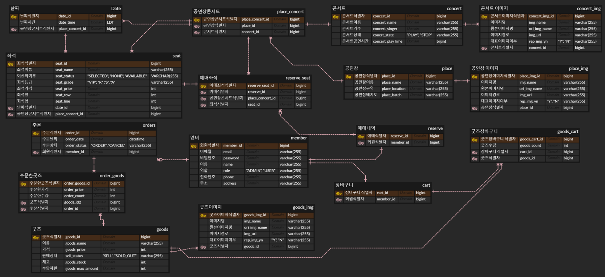
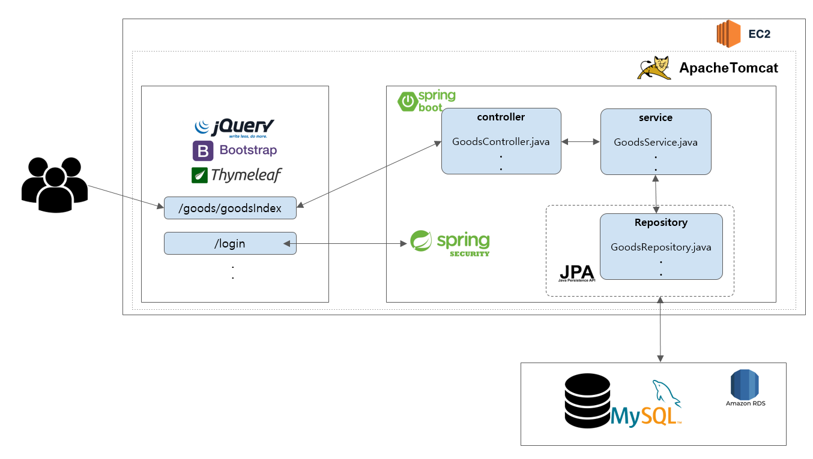
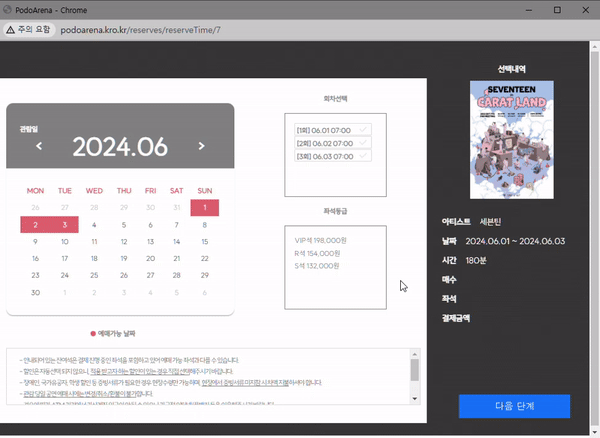
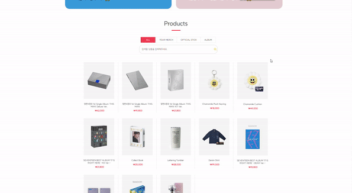

# 포도알레나 🎟️🍇

 콘서트 티켓 예매, MD샵 상품 구매

## 목차
- [웹사이트 링크](#웹사이트-링크)
- [팀 구성원](#팀-구성원-)
- [프로젝트 정보](#프로젝트-정보-)
- [프로젝트 목표](#프로젝트-목표-)
- [사용된 기술](#사용된-기술-)
- [ERD, Architecture, Figma](#erd-architecture-figma)
- [페이지 소개](#페이지-소개)
- [주요 기능](#주요-기능-)

## 웹사이트 링크
http://podoarena.kro.kr/

 
## 팀 구성원 📋

| 이름   | 역할            | 이메일                   | 깃허브 |
|--------|-----------------|--------------------------|----------------|
| 원상운 | 프로젝트 리더 | wsu063@gmail.com      | https://github.com/wsu063  |
| 박은화 | 프론트, 백엔드 | cu_oo@naver.com     | https://github.com/poelri |
| 오승찬 | 프론트, 백엔드 | htc_desirehd@naver.com     | https://github.com/sseung519 |
| 이정민 | 프론트, 백엔드 | exo1461@naver.com | https://github.com/Jjeongmean |

 

원상운

- **Frontend**
  - 사이트 인덱스, 헤더, 푸터 디자인
  - 관리자 페이지의 인덱스와 헤더 부분 구현
  - (관리자) 고객 예매 목록 관리
- **Backend**
  - 프로젝트 배포 관리
  - 마이페이지 회원정보 수정 기능 지원
  - (관리자) 고객 예매 목록 기능 구현
  - 콘서트 상세 페이지 개발 및 유지 보수 지원
  - 공연장 정보 등록, 수정, 삭제 기능 개발
  - (사용자) 콘서트 티켓 예매하기 백엔드 기능 구현
  - (사용자) 굿즈 결제하기 백엔드 구현
  - (사용자) 장바구니 기능 구현

 

박은화

- **Frontend**
  - 로그인 페이지 디자인
  - (사용자) 콘서트 디테일 및 예매 페이지 디자인 지원
  - (사용자) MD 샵의 상세 페이지와 인덱스 페이지 디자인 지원
  - (관리자) 페이지의 전반적인 디자인( 인덱스와 헤더 및 리스트,수정,삭제 )
  - 전반적인 사이트 디자인 및 사용자 경험 개선
  - 콘서트 티켓 예매하기 프론트 구현
  - 프로젝트 설명을 위한 프레젠테이션(PPT) 제작
- **Backend**
  - 로그인 및 아이디 쿠키 저장 기능을 구현
  - (사용자) 콘서트 예매 목록의 백엔드 로직 구현
  - (사용자) MD샵 상세 페이지 및 인덱스 관련된 백엔드 로직 개발
  - (관리자) MD샵 상품 관리 기능 백엔드 구현

 

오승찬

- **Frontend**
  - 사용자 회원가입 페이지 설계 및 구현
  - 이메일 및 전화번호를 이용한 비밀번호 재설정 디자인
  - 마이페이지 디자인
  - 프로젝트 README 문서 작성
  - MD샵 인덱스 페이지 디자인 지원
- **Backend**
  - 사용자 회원가입 페이지 기능 구현
  - 이름과 번호로 아이디 찾기 기능 및 비밀번호 재설정 구현
  - 사이트 데이터 추출 및 가공 작업 수행
  - 마이페이지 회원정보 수정 백엔드 구현
  - MD샵 상품 검색과 페이징 처리 기능 개발
  - (사용자) MD샵 상세 페이지 및 인덱스 관련된 백엔드 로직 개발

 

이정민

- **Frontend**
  - (사용자) 인덱스, 헤더, 푸터 디자인
  - 회원가입 디자인 지원
  - MD샵 상세페이지, 장바구니 디자인
  - (사용자) 콘서트 상세 페이지 디자인 지원
  - (사용자) 굿즈 예매 및 주문 내역 관리 페이지
  - 전반적인 사이트 디자인 및 사용자 경험 개선
- **Backend**
  - MD샵 장바구니 백엔드 로직 구현
  - (사용자) 굿즈 결제 백엔드 기능 구현
  - (사용자) 굿즈 주문 내역 백엔드 처리

## 프로젝트 정보 📃
- **개발 기간:** 2024.05.23 ~ 2024.06.18
- **프로젝트 개요:** 아이돌 콘서트 예매와 굿즈(MD) 판매를 한 플랫폼에서 제공하는 통합 서비스

## 프로젝트 목표 🎯

티켓 예매와 굿즈 구매를 한 곳에서 편리하게 제공함으로써 이용자 경험 향상, 콘서트와 굿즈 판매의 정보를 한 눈에 제공하여 사용자의 정보 획득 용이

## 사용된 기술 📚

### 백엔드 

- **Java** 
- **Spring Data JPA(Hibernate)** 
- **Spring Boot** 
- **Spring Security** 
- **MySQL DB** 

### 프론트엔드

- **Thymeleaf** 
- **Bootstrap** 
- **JavaScript** 
- **JQuery**
- **HTML, CSS** 

### 보안

- **CSRF Protection**

## ERD, Architecture, Figma

ERD

Architecture

 

<li><a href="https://www.figma.com/design/Ls4wHm9XDGkq76kE6bf9O9/%ED%8F%AC%EB%8F%84%EC%95%8C%EB%A0%88%EB%82%98?node-id=0-1&t=XxNJ1mHXJmdDyjgW-0">Figma</a></li>

## 페이지 소개

 

페이지별 공통 기능

 
  - 상단 헤더
    - 메인페이지(콘서트), MD샵 페이지로 이동할 수 있습니다.
    - 로그인, 회원가입 페이지로 이동 가능하며, 로그인 시 로그아웃, 장바구니 마이페이지 이동 버튼이 활성화 됩니다.
  - 하단 푸터

 

메인 페이지(콘서트)

 
  - 페이지 구성
    - 상단 버튼: 페이지 상단으로 이동하는 "TOP" 버튼이 제공됩니다.
  - 상단 슬라이드
    - 콘서트, 광고 등 이미지 출력
  - 콘서트 클립
    - 아티스트의 콘서트 유튜브
  - 콘서트 리스트
    - 등록된 콘서트 썸네일과 제목으로 출력

 

콘서트 상세 페이지 / 예매 페이지

 
  - 콘서트 상세 정보와 예매하기 버튼
  - 예매 페이지
  - 

 

MD 페이지

 
  - 상단 슬라이드
    - 굿즈 광고 배너
  - 굿즈 리스트
    - 굿즈 카테고리별 분류
    - 
    - 굿즈 이름 검색
    - 굿즈 리스트 출력(상품 20개씩 출력)
    - 페이징 처리

 

MD 상세 페이지

 
  - 페이지 구성
    - 상단 버튼: 페이지 상단으로 이동하는 "TOP" 버튼이 제공됩니다.
  - 상품 정보
    - 상품 이미지: 대표 상품 이미지가 표시됩니다.
    - 상품 정보: 상품 이름과 가격이 표시됩니다. 무료배송 여부도 함께 표시됩니다.
    - 상품 수량 선택: 수량을 선택할 수 있는 인터페이스가 제공되며, 최대 구매 가능 수량이 표시됩니다.
  - 구매 옵션
    - 장바구니 추가 및 구매: 사용자가 로그인 상태에 따라 "장바구니 추가"와 "바로 구매" 버튼이 제공됩니다.
    - 로그인하지 않은 경우: "장바구니 추가" 버튼이 비활성화 상태로 표시됩니다.
    - 로그인한 경우: "바로 구매" 버튼과 함께 "장바구니 추가" 버튼이 활성화 상태로 표시됩니다.
  - 상품 설명 탭
    - 상품 설명: 상품의 세부 정보와 이미지가 포함된 탭이 제공됩니다.
  - 기타 기능
    - 판매 공지: 상품의 판매 관련 정보가 포함된 공지사항이 표시됩니다.

 

로그인/회원가입/아이디 찾기/비밀번호 찾기/회원정보 수정 페이지

 
  - 로그인 페이지
    - 아이디와 패스워드를 올바르게 입력하면 로그인이 가능합니다.
    - 아이디 정보를 쿠키에 저장하여 다음 로그인 시, 로그인 했던 아이디가 자동 입력됩니다.
    - 존재하지 않는 아이디와 올바르지 않은 패스워드 입력 시 안내 문구를 보여줍니다.
    - 아이디 찾기/ 비밀번호 찾기/ 회원가입 페이지로 이동 가능합니다.

  - 회원가입 페이지
    - 회원정보(이름, 이메일, 패스워드, 주소, 전화번호)를 입력할 수 있습니다.
    - 이미 등록된 이메일과 번호는 중복으로 입력할 수 없습니다.
    - 회원 정보 설정
      - 이름
      - 이메일: email@email.com 형식 확인
      - 비밀번호: 8~16자 알파벳 대,소문자, 특수문자 포함
      - 주소: 카카오 주소 라이브러리 이용하여 도로명 주소, 번지 주소로 검색 하여 등록

  - 아이디 찾기/비밀번호 찾기(재설정) 페이지
    - 가입 시, 입력한 이름, 전화번호로 아이디를 찾을 수 있습니다.
    - 가입 시, 입력한 이메일, 전화번호로 비밀번호를 재설정 할 수 있습니다.

  - 회원정보 수정 페이지
    - 비밀번호를 재입력하여 인증 후 비밀번호, 주소 수정 가능
    - 회원탈퇴 버튼을 누르면 팝업창에 한번더 '탈퇴' 메시지를 입력 후 탈퇴 확인창 확인 후 탈퇴 가능합니다.

 

콘서트 예매내역/ 굿즈 주문내역 페이지

 
  - 페이지 구성
    - 제목: "콘서트 예매내역"이라는 제목이 화면 상단에 표시됩니다.
  - 예매내역 테이블
    - 테이블: 예매된 콘서트의 목록이 테이블 형태로 나타납니다.
    - 테이블 헤더: 예매번호, 콘서트 이름, 공연장 이름, 공연 시간, 공연 좌석, 예매 취소 버튼의 열이 표시됩니다.
    - 데이터 출력: Thymeleaf의 조건부 블록을 사용하여, 예약된 좌석 정보가 있는 경우에만 해당 정보가 표시됩니다.
      각 예약된 좌석에 대해 예매번호, 콘서트 이름, 공연장 이름, 공연 시간, 공연 좌석이 테이블에 출력됩니다.
      예매 취소 버튼은 해당 예매를 취소하는 기능을 제공합니다.
  - 예매 취소 기능
    - 예매 취소 버튼: 각 예매된 좌석에는 예매 취소를 위한 버튼이 포함됩니다.
      - 버튼을 클릭하면 JavaScript 함수 deleteReserveSeat(reserveSeatId)가 호출됩니다.
      - 사용자는 버튼을 클릭한 후 확인을 누르면 예매를 취소할 지 물어보는 알림창이 표시됩니다.
      - 확인을 선택하면 AJAX를 통해 해당 예매 좌석을 서버에서 삭제하고 페이지를 새로고침하여 업데이트합니다.
      - 만약 로그인 되어 있지 않은 경우, AJAX 요청이 실패하고 사용자는 로그인 페이지로 리디렉션됩니다.
  - CSRF 보안
    - CSRF 토큰: 페이지 로드 시 메타 태그에 포함된 CSRF 토큰과 헤더를 AJAX 요청에서 사용하여 보안을 강화합니다.

 

관리자 페이지

 
  - 페이지 구성
    - 제목
      - 페이지 상단에 표시
    - 테이블 구성
      - 리스트를 테이블 형태로 출력합니다.
      - 테이블 헤더 : 번호, 이름, 수정, 취소 버튼의 열로 표시됩니다.
    - 테이블 출력
      - Thymeleaf의 조건부 블록을 사용하여 해당 조건이 충족할때만 해당 정보가 표시됩니다.
    - 삭제 기능
      - 휴지통 아이콘을 클릭하면 취소할 지를 묻는 알림참이 표시됩니다.
    - CSRF 보안
      - 페이지 로드 시 메타 태그에 포함된 CSRF 토큰을 AJAX 요청의 헤더에 포함하여 보안을 강화합니다.
      - 이를 통해 CSRF 공격으로부터 보호됩니다.

## 주요 기능 ✨

- **콘서트 티켓 예매:** 콘서트 티켓을 예매 후 DB에 저장합니다.
- **MD 샵:** 좋아하는 아티스트와 이벤트 관련 상품을 탐색하고 구매할 수 있습니다.
- **안전한 거래:** CSRF토큰을 이용 해 보안을 위해 한번 더 체크.

